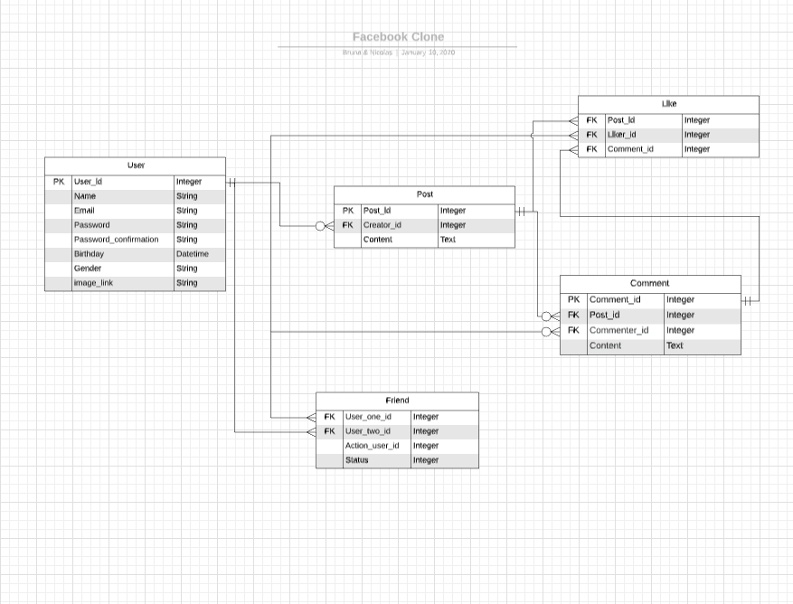

# Facebook Clone
In this app we created a facebook like application. It has the following functionalities:
- User can create an account;
- Users can make posts;
- Users can like and comment on posts;
- Users can request friendship from others sign up users.

## Preview

### Models data architecture

## Built with

- HTML 5 (erb);
- CSS 3 (scss);
- Ruby 2.6.3;
- Rails 6.0.1;
- Semantic UI sass.

## Authors

:woman: **Bruna Genz**

- Github: [@bruna-genz](https://github.com/bruna-genz)

:man: **Nicolás Mariño**

- Github: [@nicolasmarino99](https://github.com/nicolasmarino99)
