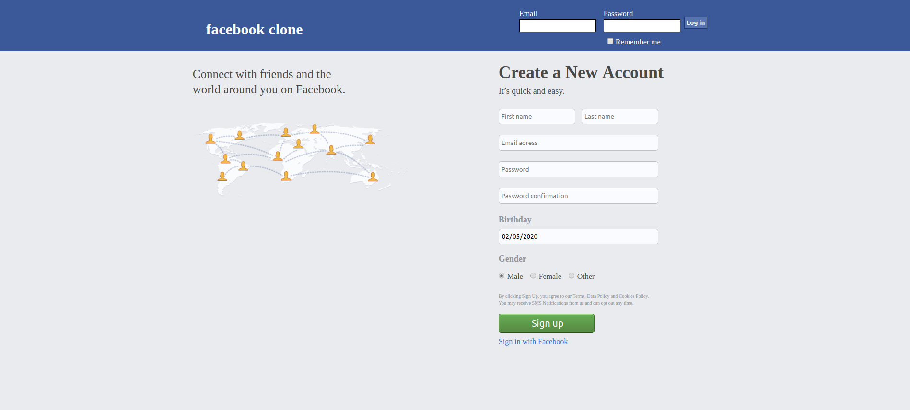
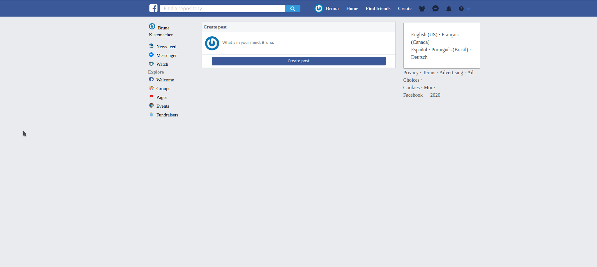
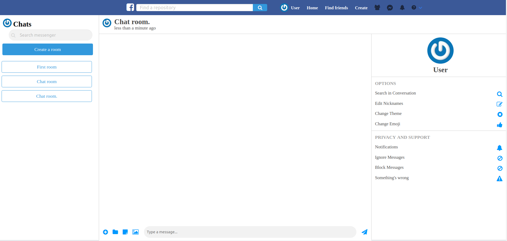

# Facebook Clone
In this app we created a facebook like application. It has the following functionalities:
- User can create an account or sign up with Facebook;
- Users can make posts;
- Users can like and comment on posts;
- Users can request friendship from others sign up users;
- Users can create chat rooms and talk to other users (see section Future Improvements);
- Functional search bar to find users.

## Preview

[Live version](https://fb-clone-bruna-nico.herokuapp.com/contents/new)

### Login page

### Home page

### Chat

### Models data architecture

## Built with

- HTML 5 (erb);
- CSS 3 (scss);
- Ruby 2.6.3;
- Rails 6.0.1;
- JavaScript;
- Bulma.

## Authors

:man: **Nicolás Mariño Parra**

- Github: [@nicolasmarino99](https://github.com/nicolasmarino99)
- Twitter: [@nicolasmarino99](https://twitter.com/nicolasmarino99)
- Linkedin: [Nicolás Mariño Parra](https://www.linkedin.com/in/nicol%C3%A1s-mari%C3%B1o-parra-45a707177/)
- Email: nicolasmarinoparra@gmail.com

:woman: **Bruna Genz**

- Github: [@bruna-genz](https://github.com/bruna-genz)
- Twitter: [@Bruna_GK](https://twitter.com/Bruna_GK)
- Linkedin: [Bruna Genz](https://www.linkedin.com/in/brunagenz/)
- Email: brunagenz92@gmail.com

## Acknowledgements

- To create the Friendships we use the following tutorial as reference: https://smartfunnycool.com/friendships-in-activerecord/;
- To the chat: https://iridakos.com/programming/2019/04/04/creating-chat-application-rails-websockets;

## Future improvements:

- Currently, the user has to refresh the page on the chat to display new messages. The goal is to make the chat asynchronous. 
